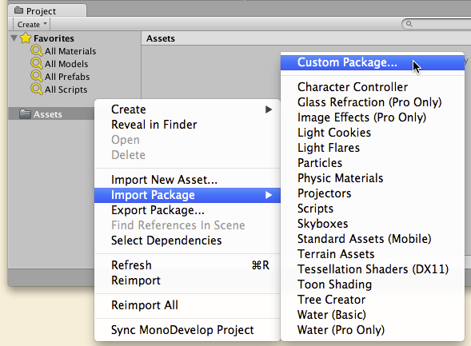
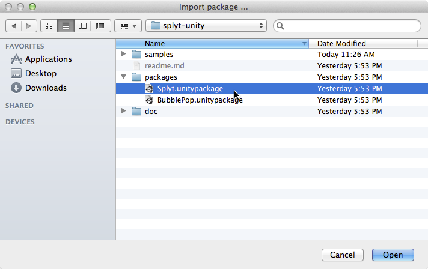
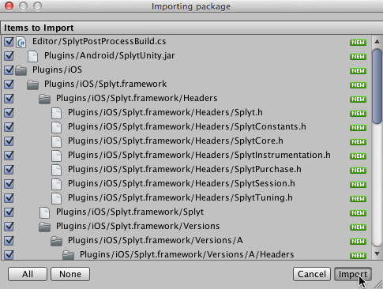

Adding SPLYT to Your Own App
=========

Last Updated: January 24, 2014

In the BubblePop sample, both the Unity package and project versions were preconfigured to use the SPLYT SDK Unity package.

When adding SPLYT to your own app, you will need to import this package yourself.  To do so, follow these steps:

1. Open your Unity project.
2. In Unity's Project Browser, right-click (sometimes referred to as a Control-click or Secondary click) on the root Assets folder, and then choose **Import Package | Custom Package...**:  
    
3. In the window that appears, find the directory where you extracted the SDK and navigate to its `packages` subdirectory. Highlight the `Splyt.unitypackage` file and then click **Open**.  
    
4. A dialog will appear listing the contents of the package, all of them checked by default.  Leave everything checked and click **Import**  
*(Note: After importing, you may see an error message in the status bar or Console window that says `typeTree.m_Children.front().m_Type != SerializeTraits<SInt32>::GetTypeString(NULL)`. This is a known issue.  The error message goes away the first time you build or run the BubblePop sample, and does not block it from functioning correctly).*  
    
5. At this point, you should be able to start adding code to your app that uses the SPLYT APIs to send telemetry data.