Using the BubblePop Sample
=========

Last Updated: January 24, 2014

## Introduction 

The SDK includes a very simple Unity game that exercises some of the features of SPLYT.  This serves as a good starting point for many new users.  By stepping through the sample code, you can see how the SPLYT APIs are called.  Further, you can use SPLYT's SDK Debugger tool to verify that telemetry sent by these APIs were received by SPLYT.

BubblePop is an extremely simple game that sends data to SPLYT.  In this game: 

* You have a balance of virtual currency, referred to as "gold". 
* To play a game, you need to spend some of your gold.
* In the game, you click on bubbles to pop them.  One of these bubbles is a "winning" bubble.  The goal is to find that bubble before it is the only one left.
* If you win and find the winning bubble before it is the only one left, you are awarded some gold.
* You can also add more gold to your account by making an in-app purchase (don't worry -- in this sample game you don't actually have to spend money to make an in-app purchase!).

Admittedly, this game is not technically impressive; nor is it even all that much fun!  It simply exists to illustrate the steps involved in implementing SPLYT in an app.

The following steps walk you through the process of running the BubblePop sample.  These steps are based on Unity 4 running on Mac OS X.  The steps should be similar for other platforms and versions of Unity.

## Working with the Sample Application 

The SDK provides the BubblePop sample as both a Unity package and as a Unity project.

The advantage of a package is that it is less sensitive to Unity version differences than a project is.  So if you are using an older version of Unity and have difficulty opening the BubblePop project, try importing the BubblePop Unity package instead.

The sample project was created using Unity 4.3.3f1, and may not be usable from older versions of Unity.  In this case, try using the package version of the sample instead.

### Setting Up the Sample Project

The two sections that follow walk you through the two different ways of setting up the sample application. The first is based on the Unity package.  The second is based on a Unity project.  You only need to follow the steps from one of these sections, based on your Unity version and preference.

With either option, the very first thing you'll need to do is to start Unity.  On Mac OS X, Unity is normally installed to the `/Applications/Unity` folder:

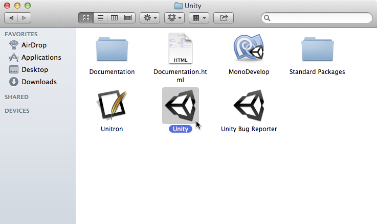

#### Option 1: Set Up the Sample Using `BubblePop.unitypackage`

1. After starting Unity, if the **Project Wizard** window does not open automatically when starting Unity, then open it by selecting Unity's **File** menu, then selecting **New Project...**, as shown below.
    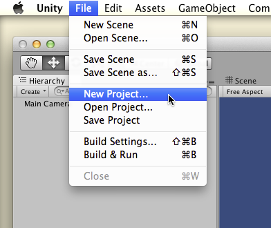
2. In the **Project Wizard** window, click **Create new Project**.  Then set the **Project Directory** to the location where you want to store the project, and then click **Create Project**:
    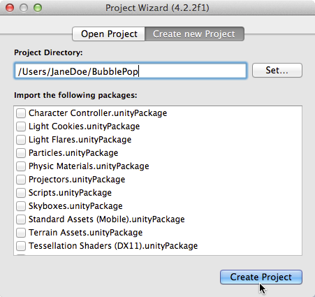
3. In Unity's Project Browser, right-click (sometimes referred to as a Control-click or Secondary click) on the root Assets folder, and then choose **Import Package | Custom Package...**:
    
4. In the window that appears, find the directory where you extracted the SDK and navigate to its `packages` subdirectory.  Highlight the file `BubblePop.unitypackage` and then click **Open**.
    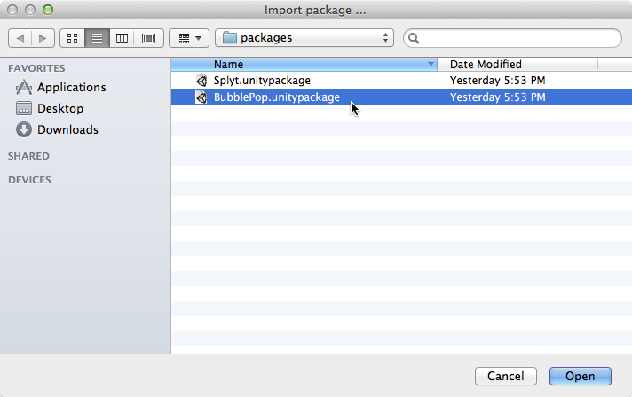
5. A dialog will appear listing the contents of the package, all of them checked by default.  Leave everything checked and click **Import**.  
*(Note: After importing, you may see an error message in the status bar or Console window that says `typeTree.m_Children.front ().m_Type != SerializeTraits<SInt32>::GetTypeString (NULL)`. 
This is a known issue.  The error message goes away the first time you build or run the BubblePop sample, and does not block it from functioning correctly).*  
    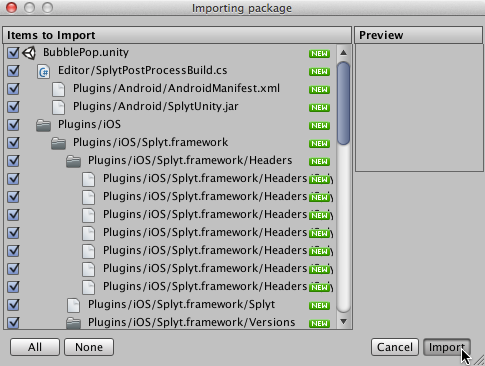
6. At this point, the sample project should be set up correctly.  Skip to the section [Running the Sample](#running) for the next steps you need to perform in order to run it.

#### Option 2: Set Up the Sample Using the BubblePop Project

1. After starting Unity, if the **Project Wizard** window does not open automatically when starting Unity, then open it by selecting the **File | Open Project...** menu item as shown below:  
    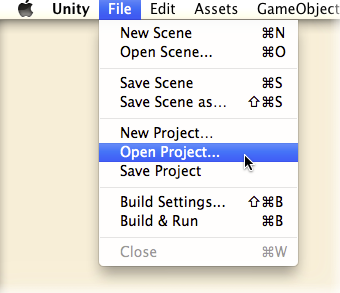
2. In the **Project Wizard** window, click **Open Other...**  
    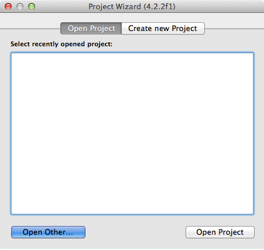
3. Find the directory where you extracted the SDK and navigate to its `samples` subdirectory.  Inside of `samples`, highlight the `BubblePop` subdirectory and then click **Open**.
    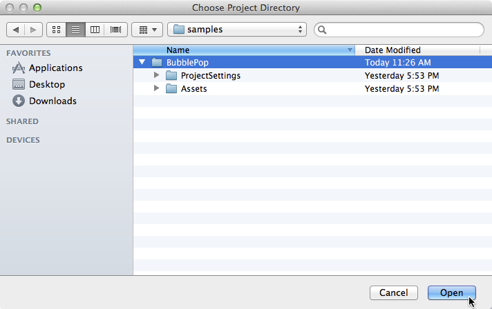
4. At this point, the sample project should be set up correctly.  Continue on to the section [Running the Sample](#running) for the next steps you need to perform in order to run it.

### Running the Sample

Once you have set up the BubblePop sample project set up, you need to follow a few more steps to run it.

#### Optional: Setting Your SPLYT product ID

To see your events in SPLYT, the game needs to be initialized with your unique product ID.  

Note that you may skip this step and continue to run the sample. However, if you skip this step, the data for BubblePop will not be visible to you in SPLYT's SDK debugger and dashboards.

If you *do* choose to set your product ID to send BubblePop data to SPLYT, you will only want to send it to your `test` environment.  And if you wish to remove the BubblePop data from SPLYT at a later date, you will need to send a request to the [SPLYT Support Team](mailto:support@splyt.com) to do this for you.  A request to clear the data in your SPLYT `test` environment will result in *all* data being removed, whether it came from the BubblePop sample or your own app.

1. To use your specific product ID, we'll need to change the code in BubblePop. To open the BubblePop code, right-click anywhere in the **Assets** pane and then click **Sync MonoDevelop Project**:
    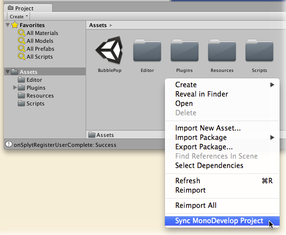
2. The MonoDevelop-Unity IDE will open.  Edit the file `BubblePop.cs`, and look for the spot where the initialization parameters for SPLYT are created.  Change the default product ID  from `splyt-bubblepopunity-test` to your own product ID.  Be sure to specify the product ID for your test environment; it should end with the characters "<code>-test</code>" *(Note: If you do not have or do not know your SPLYT product ID, contact [support@splyt.com](support@splyt.com) to get one)*.
    
3. Close the MonoDevelop-Unity IDE and return to Unity.

#### Set the Scene and Run BubblePop

At this point, you should have your project set up.  We're almost ready to run!  Just follow these few additional steps:

1. In the Project Browser, make sure the the root Assets folder is selected.  Then, in **Assets** pane, double-click **BubblePop** to 
make it the active scene.  
*(Note: You may get a prompt asking if you to save the changes to the current untitled scene.  If you do, you can 
simply click **Don't Save** to discard it)*.  
    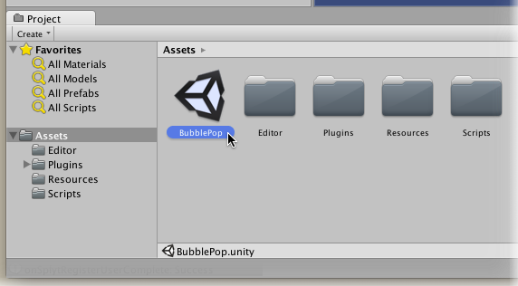
2. Press the **Play** button in the Unity toolbar to start BubblePop.  The game should start:  
    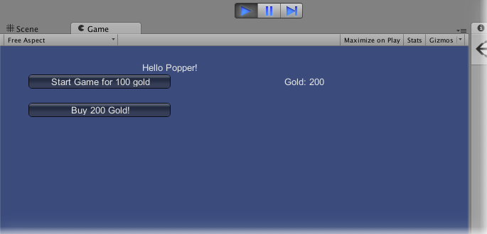
3. You can click around in the BubblePop game to play. If necessary, you can refer back to the [introduction](#introduction) for a description of this simple game.
4. Note that in the current release of this SDK, only iOS and Android are supported.  To see your events arriving at SPLYT, you will need to generate and run a build for one of those devices.  The next section walks through this process.

## Viewing Your Data in SPLYT

If you chose to [set up a valid product ID for BubblePop](#productid), then you can use SPLYT's SDK Debugger to verify that SPLYT is receiving the data sent by BubblePop.  To do this, follow these steps:

### Generate and Run an iOS or Android Build

This SDK release supports iOS and Android.  If you target any other platform, the SPLYT API calls simply act as stubs and no data will actually be sent to SPLYT.  So to see data arriving at SPLYT, we need to build for one of these platforms.  These instructions walk through the necessary steps for iOS.

1. In Unity, choose the **File | Build Settings...** menu item:  
    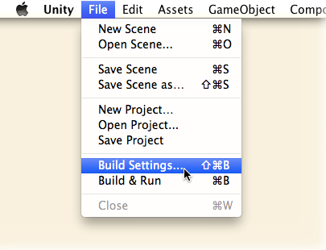
2. In the **Build Settings** window, select **iOS** as the platform, and then click **Build and Run**.  
    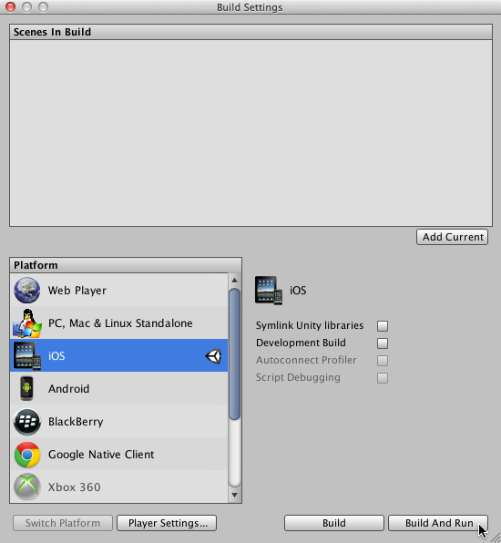
3. Unity will generate an Xcode project for iOS.  A window opens where you can specify the directory where the Xcode project will be created.  Specify your desired location and click **Save**:  
    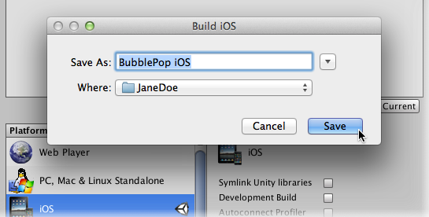
4. After Unity finishes creating the Xcode project, Xcode will open.  Click the Play button to build and run the project.  
    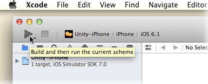
5. BubblePop will build and begin running on your iOS device or simulator, depending on the selected scheme in Xcode.  You can click around in the BubblePop game to play. If necessary, refer back to the [introduction](#introduction) for a description of this simple game:  
    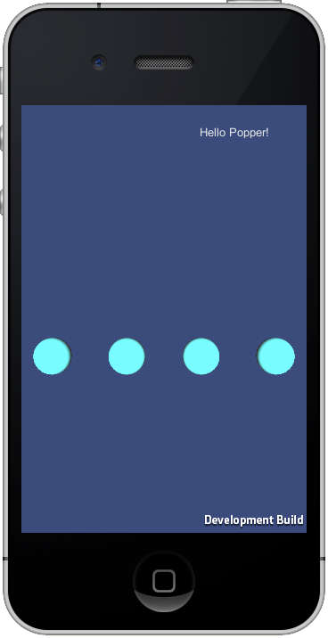

### Using the SDK Debugger Page to View your Data

As BubblePop runs on the device, it will send data to SPLYT about what is happening in the game. You can use SPLYT's SDK Debugger page to verify that this data is arriving at SPLYT.

1. Open a web browser, navigate to [https://dashboard.splyt.com](https://dashboard.splyt.com), and log into SPLYT.
2. Choose the product [whose product ID you specified](#productid) when you set up the sample:  
    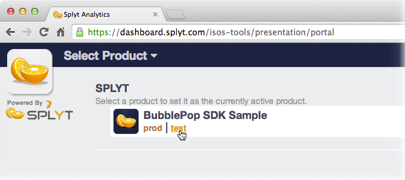
3. Choose **Tools** from the nav bar on the top right:  
    
4.	Once in the Tools section, choose the **Debugger** tool from the nav bar on the left.
5.	As you continue to play the BubblePop game that you started on iOS during the steps above, the SDK Debugger page will periodically refresh and show data that the game is sending to SPLYT.  You can use this to verify that your app is able to talk to SPLYT, and that your instrumentation is correct.  
    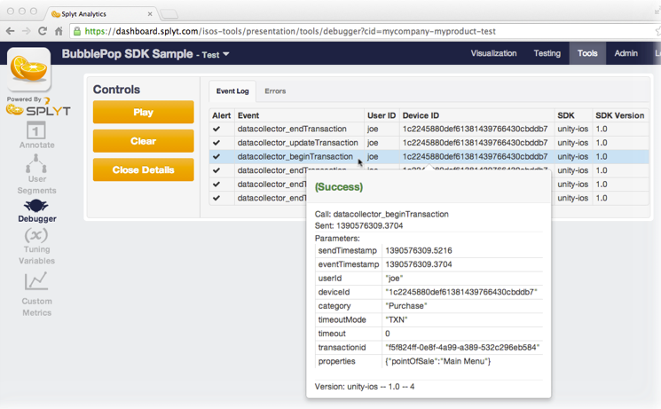  
    Some tips on how to use this page:  
    * The page shows the 25 most recently received events.
    * By clicking on a given event/row, you will see more details.  These details make it easier to match up the data that you see in the debugger with the spot in your code where you called SPLYT to send the data. Click the **Close Details** button to dismiss these details.
    * If there are any errors in the data that gets sent, they will be highlighted in red.
    * This page shows events received from *all* clients running your app.  It's best to use this page when few clients are running, so that the event stream is more easily interpretable.
    * The controls on the left include a **Play/Pause** toggle and a **Clear** button:
    	* If you toggle the page to **Pause** mode, it will not refresh with new events until you toggle it back to **Play**.  At that point, all events received since the page was paused will be retrieved.
    	* **Clear** permanently removes all events currently shown on the page.
    * This page only works for test environments (i.e., for SPLYT product IDs ending in `-test`).
6. Data that is received by SPLYT will ultimately be included into all the charts available from the **Visualization** section of SPLYT.  SPLYT processes your data periodically throughout the day.  In general, you should expect your dashboards to update with new data within a couple of hours of the time it was received.

